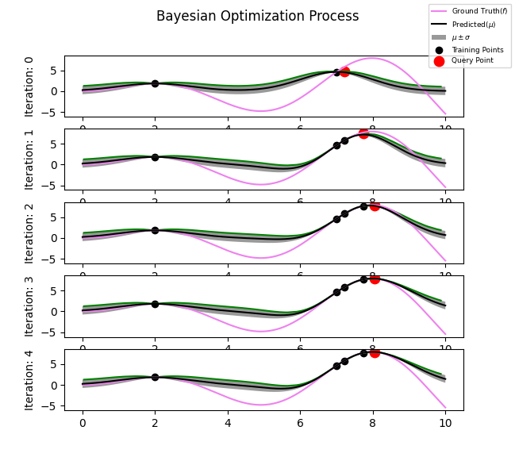

# Bayesian Optimization from Scratch

This python script illustrates how to implement bayesian optimization from scratch in Python.
Please refer to https://distill.pub/2020/bayesian-optimization for details

## Bayesian Optimization Simulation


## Python Console Output

```
[iter=0] Query_x=7.146, Predicted_f=4.55, Ground_Truth_f=5.427
[iter=1] Query_x=7.488, Predicted_f=6.784, Ground_Truth_f=6.992
[iter=2] Query_x=7.713, Predicted_f=7.535, Ground_Truth_f=7.637
[iter=3] Query_x=8.052, Predicted_f=7.95, Ground_Truth_f=7.895
[iter=4] Query_x=8.052, Predicted_f=7.895, Ground_Truth_f=7.895
```

## Contributing
I have implemented 1D objective function optimization using gaussian process as the surrogate model
and probability of improvement as the acquisition function. Actually, there are a wide variety of options for
acquisition functions. 

Pull requests are welcome. For major changes, please open an issue first to discuss what you would like to change.

Please make sure to update tests as appropriate.

## License
[MIT](https://choosealicense.com/licenses/mit/)